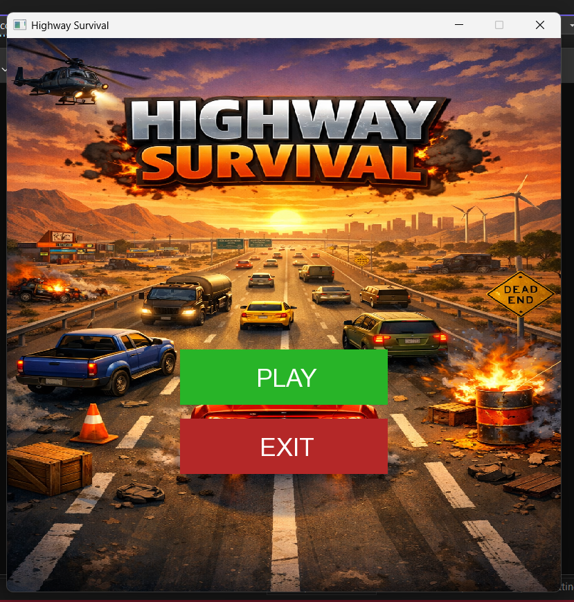
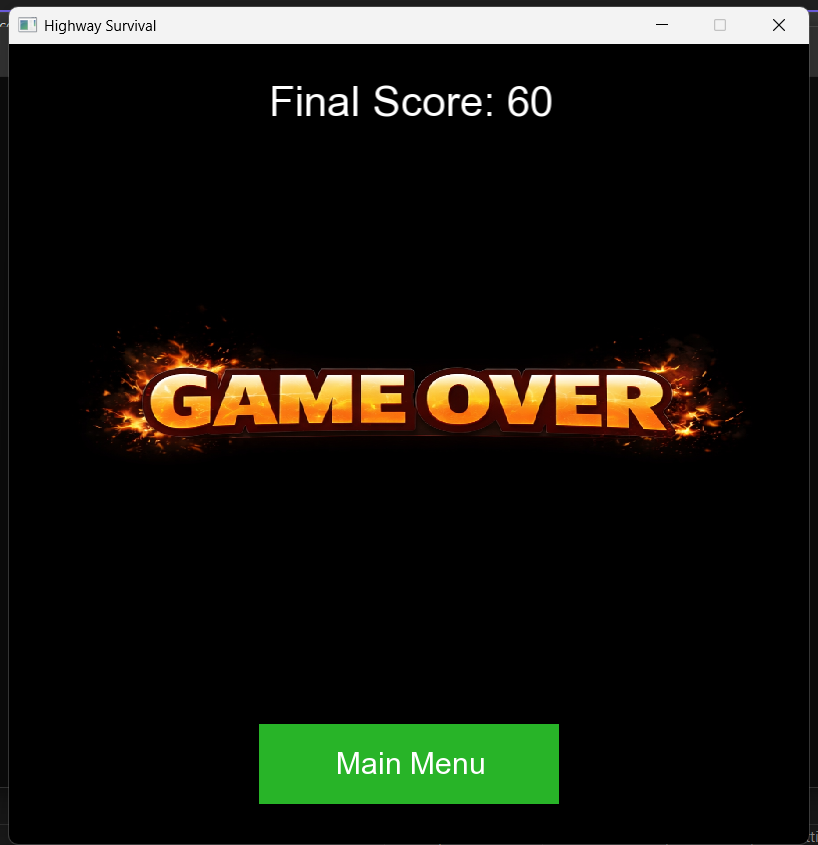

# Highway Survival

## Description
Highway Survival is an engaging car game where the player drives along a highway, avoids obstacles, and tries to achieve the highest score.  
The game challenges players' reflexes and decision-making as obstacles appear randomly in multiple lanes.  
With smooth animations, real-time scoring, and responsive controls, Highway Survival offers an exciting and dynamic gameplay experience.

---

## Features
- Smooth car and obstacle movement  
- Random obstacle generation in multiple lanes  
- Score tracking  
- Collision detection  
- Main menu and game-over screens  

---

## Data Structures
- **Linked List:** Manages obstacles dynamically for efficient addition, update, and removal.

---

## How to Play
- **Controls:** Left Arrow → move left, Right Arrow → move right  
- **Objective:** Avoid obstacles and increase score by 10 points per obstacle  
- **Game Over:** Collision ends the game; restart from main menu  

---

## Screenshots

### Main Menu

### Gameplay

### Game Over

---

## Tools
- C++  
- SFML  
- Git

## System Design

### Flowchart

### Class Diagram

